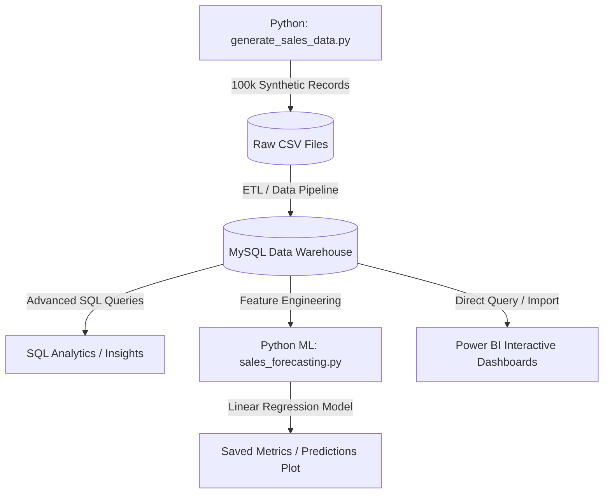
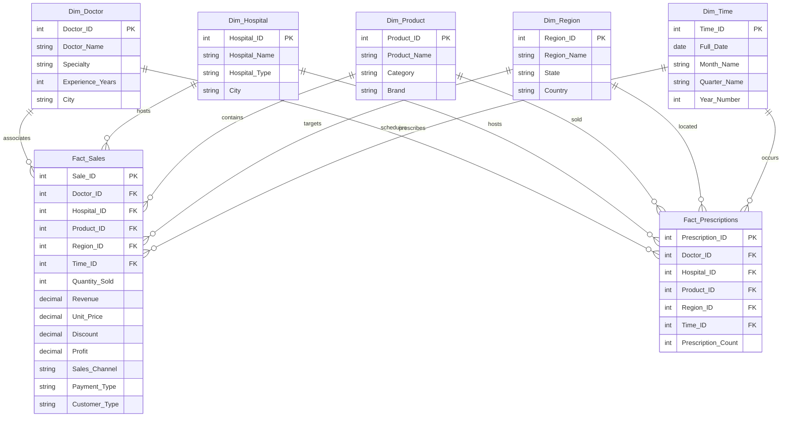

# Healthcare Commercial Analytics Platform - Project Architecture

This document describes the design, data model, directory structure, and predictive analytics workflow of the **Healthcare Commercial Analytics Platform**.

---

## 🏗️ System Overview

The platform uses a modular data engineering and analytics pipeline designed to simulate a modern pharmaceutical commercial analytics platform.

---

## 📊 Data Model & Schema Design

The data warehouse implements a **Star Schema** designed for optimal query performance and reporting speed in business intelligence tools like Power BI.

> [!NOTE]
> The database schema consists of **5 Dimension Tables** and **2 Fact Tables** containing 100,000 synthetic rows of sales and commercial activity.

### Star Schema ER Diagram

---

## 📂 Project Directory Structure

The workspace is organized into separate directories grouped by language, environment, and purpose:

| Directory | Purpose | Key Files |
| :--- | :--- | :--- |
| `data/raw/` | Raw synthetic datasets generated by Python scripts | `raw_claims.csv`, `raw_prescriptions.csv` |
| `docs/` | System architecture, data model, and API documentation | `project_architecture.md` |
| `ml/` | Machine learning experiments and model checkpoints | Notebooks / models |
| `powerbi/` | Power BI Desktop reporting and dashboard files | `Healthcare_Commercial_Analytics2.pbix` |
| `python/` | Python data generation and machine learning scripts | `sales_forecasting.py`, `generate_sales_data.py` |
| `screenshots/` | Visualization artifacts, outputs, and dashboard views | `actual_vs_predicted.png` |
| `sql/` | Database schema initialization and analytic scripts | `schema.sql`, `sample_queries.sql` |
| `tableau/` | Tableau Desktop workbook designs | Workbooks / datasources |

---

## 🤖 Predictive Modeling Pipeline

The predictive analytics layer uses a Python-based regression model to predict sales revenues and forecast demand.

1. **Feature Engineering**: Features such as `Quantity_Sold`, `Unit_Price`, and `Discount` are extracted from the dataset.
2. **Model Training**: A `LinearRegression` model from `scikit-learn` is trained on an 80/20 train/test split.
3. **Evaluation**: Metrics such as **Mean Absolute Error (MAE)** and **$R^2$ Score** are generated to measure accuracy.
4. **Visualization**: A comparison plot of actual versus predicted values is generated and saved as an image (`actual_vs_predicted.png`).

---

## 📈 Dashboard Architecture

The reporting layer translates tabular database entries into visual executive summaries:

- **Executive Dashboard**: Offers high-level insights into overall revenue, quantity sold, profit margin, and performance by region/product brand.
- **Doctor Analytics**: Breaks down prescriber-level performance, segmenting top-performing doctors by specialty, city, and total revenue contributed.
- **Regional Performance**: Enables granular slicing of sales, comparing state-level revenues, channels (e.g., retail vs. institutional), and payment methodologies.
